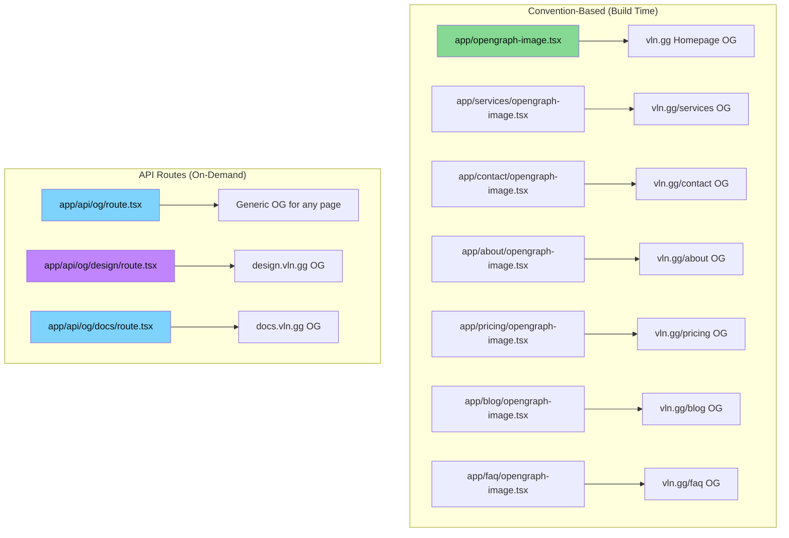
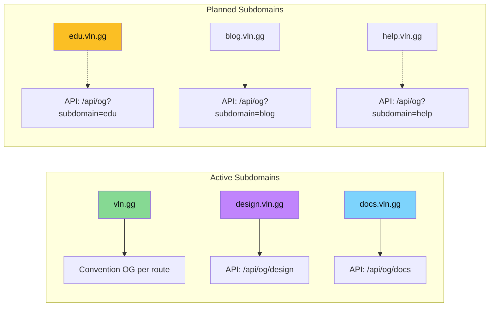
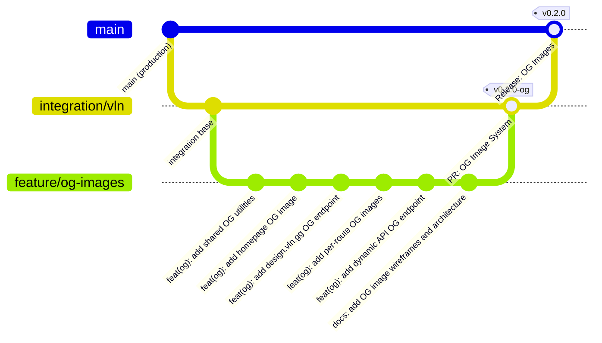
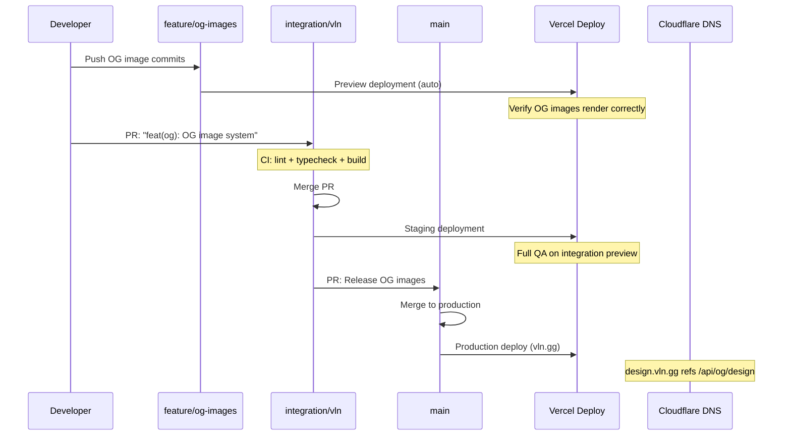
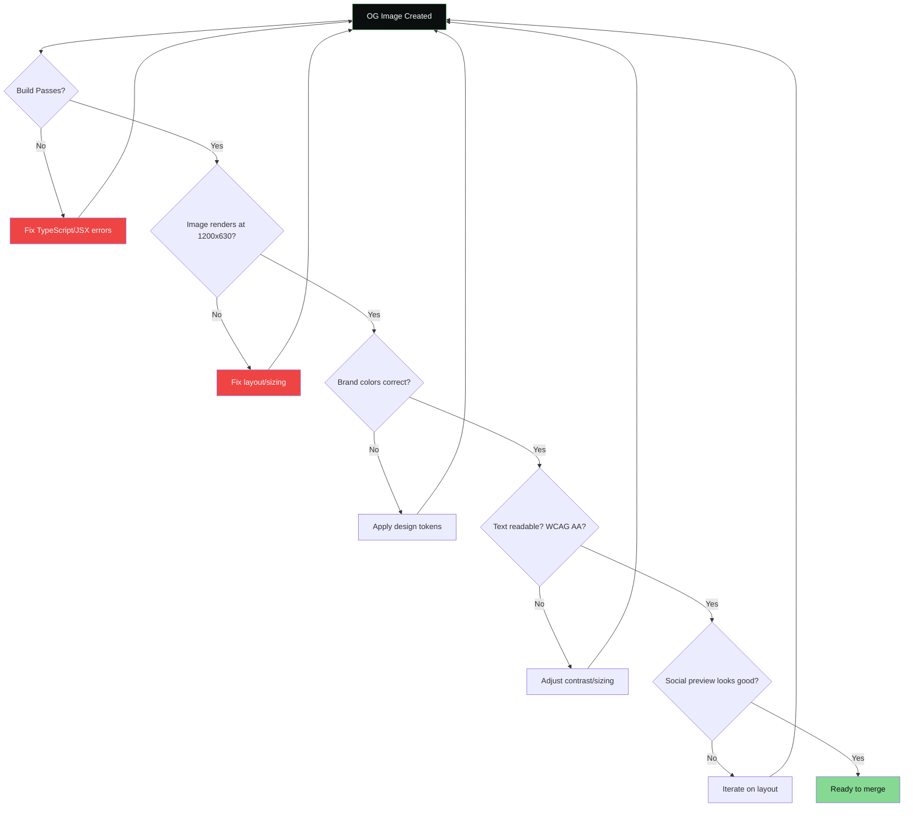

# VLN Open Graph Image System

> Dynamic OG images for all VLN subdomains using the full design system

**Last Updated:** February 2026
**Version:** 1.0
**Status:** Active

---

## Overview

VLN uses Next.js `ImageResponse` (from `next/og`) to generate dynamic, brand-consistent Open Graph images at build time and on-demand via API routes. Every OG image follows the VLN design system exactly: matte charcoal backgrounds, sage green accents, Inter + JetBrains Mono typography, and the research lab aesthetic.

---

## Architecture

### OG Image Generation Strategy



### Subdomain OG Coverage



---

## Design Tokens (OG Context)

All OG images use these exact values:

```
Canvas Size:     1200 x 630 px
Background:      #0a0e0f (vln-bg)
Card Background: #151a1c (vln-bg-light)
Border Radius:   12px
Border Color:    rgba(134, 217, 147, 0.3) (sage/30)

Primary Text:    #f8f9fa (vln-white)    — Inter Bold
Secondary Text:  #cbd5e1 (vln-gray)     — Inter Regular
Technical Text:  #86d993 (vln-sage)     — JetBrains Mono

Accent Colors:
  Sage:    #86d993  (primary brand)
  Blue:    #7dd3fc  (secondary/links)
  Amber:   #fbbf24  (urgency/warnings)
  Purple:  #c084fc  (premium/special)

Glow Effect:     0 0 24px rgba(134, 217, 147, 0.4) (sage glow, scaled for OG)
```

---

## ASCII Wireframes

### 1. Homepage OG (vln.gg)

```
┌─────────────────────────────────────────────────────────────────┐
│  #0a0e0f background                                             │
│                                                                  │
│  ┌─ Circuit trace decoration (top-left) ─────────────────────┐  │
│  │  ═══╤═══╤═══    subtle sage lines at 10% opacity          │  │
│  └────────────────────────────────────────────────────────────┘  │
│                                                                  │
│     ┌─────────────────────────────────────────────────────┐     │
│     │  [VLN LOGO - SVG]                                    │     │
│     │  164 x 40px, top-center                              │     │
│     └─────────────────────────────────────────────────────┘     │
│                                                                  │
│     ┌─────────────────────────────────────────────────────┐     │
│     │  "Your Contract Has Bugs"                            │     │
│     │  Inter Bold 48px, #f8f9fa                            │     │
│     │  "Bugs" in text-gradient-rainbow                     │     │
│     └─────────────────────────────────────────────────────┘     │
│                                                                  │
│     ┌─────────────────────────────────────────────────────┐     │
│     │  "Smart Contract Security Audits &                   │     │
│     │   Vulnerability Research"                             │     │
│     │  Inter Regular 22px, #cbd5e1                         │     │
│     └─────────────────────────────────────────────────────┘     │
│                                                                  │
│     ┌──────────┐  ┌──────────┐  ┌──────────┐                   │
│     │ 🔍 47    │  │ 💰 $5.2M │  │ 🛡️ 0     │  Trust badges    │
│     │ Critical │  │ Recovered│  │ Post-Hack│  sage border/20   │
│     │ Vulns    │  │          │  │          │  #151a1c bg       │
│     └──────────┘  └──────────┘  └──────────┘                   │
│                                                                  │
│  ┌─ vln.gg ─────────────────── Powered by Fused Gaming ─────┐  │
│  │  JetBrains Mono 14px, #94a3b8 (gray-dark)                │  │
│  └────────────────────────────────────────────────────────────┘  │
│                                                                  │
│  ┌─ Circuit trace decoration (bottom-right) ─────────────────┐  │
│  │  ═══╤═══╤═══    mirrored, sage lines at 10%               │  │
│  └────────────────────────────────────────────────────────────┘  │
└─────────────────────────────────────────────────────────────────┘
```

**Dimensions:** 1200 x 630
**Key Elements:**
- Matte charcoal full-bleed background
- Logo centered top
- Rainbow gradient on "Bugs"
- 3 trust metric badges with individual accent colors
- Subtle circuit trace decoration corners
- URL and attribution bottom bar

---

### 2. design.vln.gg OG (Design System)

```
┌─────────────────────────────────────────────────────────────────┐
│  #0a0e0f background                                             │
│                                                                  │
│  ┌────────────────────────────────────────────────────────────┐ │
│  │  LEFT PANEL (60%)              │  RIGHT PANEL (40%)        │ │
│  │                                │                            │ │
│  │  ┌────────────────────────┐   │   COLOR SWATCHES           │ │
│  │  │  [VLN LOGO]            │   │   ┌──────┐ ┌──────┐       │ │
│  │  └────────────────────────┘   │   │#86d993│ │#7dd3fc│      │ │
│  │                                │   │ Sage  │ │ Blue  │      │ │
│  │  "VLN Design System"          │   └──────┘ └──────┘       │ │
│  │  Inter Bold 42px #f8f9fa      │   ┌──────┐ ┌──────┐       │ │
│  │                                │   │#fbbf24│ │#c084fc│      │ │
│  │  "Brand Guidelines,           │   │ Amber │ │Purple │      │ │
│  │   Component Library &          │   └──────┘ └──────┘       │ │
│  │   Design Tokens"              │                            │ │
│  │  Inter 20px #cbd5e1           │   TYPOGRAPHY               │ │
│  │                                │   ┌──────────────────┐    │ │
│  │  ┌───────────────────────┐    │   │ Aa Inter          │    │ │
│  │  │ design.vln.gg         │    │   │ 01 JetBrains Mono │    │ │
│  │  │ JetBrains Mono 16px   │    │   └──────────────────┘    │ │
│  │  │ #86d993               │    │                            │ │
│  │  └───────────────────────┘    │   RADIUS: 12px ◯           │ │
│  │                                │   GLOW: 12px ◐            │ │
│  └────────────────────────────────────────────────────────────┘ │
│                                                                  │
│  ┌─ Powered by Fused Gaming ─── WCAG AAA Compliant ──────────┐ │
│  │  JetBrains Mono 12px, #94a3b8                              │ │
│  └────────────────────────────────────────────────────────────┘ │
└─────────────────────────────────────────────────────────────────┘
```

**Dimensions:** 1200 x 630
**Key Elements:**
- Split layout: text left, visual tokens right
- Live color swatches showing exact brand palette
- Typography preview showing both font families
- Design specs (radius, glow) as visual indicators
- Subdomain URL in sage green mono font
- WCAG AAA compliance badge

---

### 3. Services OG (vln.gg/services)

```
┌─────────────────────────────────────────────────────────────────┐
│  #0a0e0f background                                             │
│                                                                  │
│     [VLN LOGO]  top-left, 120x30                                │
│                                                                  │
│     "Our Services"                                               │
│     Inter Bold 44px, #f8f9fa                                    │
│     "iGaming Security & Smart Contract Intelligence"            │
│     Inter 20px, #cbd5e1                                         │
│                                                                  │
│     ┌─────────────┐ ┌─────────────┐ ┌─────────────┐ ┌────────┐│
│     │ 🛡️ Prevention│ │ 🔍 Forensics│ │ 🎓 Training │ │ 📚 VISE ││
│     │  #86d993     │ │  #fbbf24    │ │  #7dd3fc    │ │ #c084fc ││
│     │  border      │ │  border     │ │  border     │ │ border  ││
│     │              │ │             │ │             │ │         ││
│     │  $2K-10K     │ │  $15K-50K   │ │  $3.5K/day  │ │ Free+   ││
│     │  3-7 days    │ │  <24hr      │ │  1-2 weeks  │ │ Self    ││
│     └─────────────┘ └─────────────┘ └─────────────┘ └────────┘│
│                                                                  │
│  ┌─ vln.gg/services ─────────────────────────────────────────┐  │
└─────────────────────────────────────────────────────────────────┘
```

---

### 4. Contact OG (vln.gg/contact)

```
┌─────────────────────────────────────────────────────────────────┐
│  #0a0e0f background                                             │
│                                                                  │
│     [VLN LOGO]  centered, 164x40                                │
│                                                                  │
│     "Get In Touch"                                               │
│     Inter Bold 48px, #f8f9fa                                    │
│                                                                  │
│     "Start your free 30-minute                                   │
│      vulnerability scan today"                                   │
│     Inter 22px, #cbd5e1                                         │
│                                                                  │
│     ┌───────────────────────────────────────────────────────┐   │
│     │  ┌──────────────┐   sage green button mockup          │   │
│     │  │ Start Free   │   #86d993 bg, #0a0e0f text         │   │
│     │  │ 30-Min Scan  │   rounded-vln (12px)                │   │
│     │  └──────────────┘   glow: 0 0 24px sage/40            │   │
│     └───────────────────────────────────────────────────────┘   │
│                                                                  │
│     "24/7 Emergency Forensics Available"                        │
│     JetBrains Mono 14px, #fbbf24 (amber)                       │
│                                                                  │
│  ┌─ vln.gg/contact ──────────────────────────────────────────┐  │
└─────────────────────────────────────────────────────────────────┘
```

---

### 5. Pricing OG (vln.gg/pricing)

```
┌─────────────────────────────────────────────────────────────────┐
│  #0a0e0f background                                             │
│                                                                  │
│     [VLN LOGO]  top-left                                        │
│                                                                  │
│     "Transparent Pricing"                                        │
│     Inter Bold 44px, #f8f9fa                                    │
│     "Pricing" in #86d993                                        │
│                                                                  │
│     ┌──────────────┐ ┌──────────────┐ ┌──────────────┐         │
│     │  SMALL        │ │  MEDIUM       │ │  LARGE        │        │
│     │  <500 lines   │ │  500-2K lines │ │  2K+ lines    │        │
│     │               │ │               │ │               │        │
│     │   $2K-4K      │ │   $5K-8K      │ │   $10K+       │        │
│     │  #86d993 bold │ │  #86d993 bold │ │  #86d993 bold │        │
│     └──────────────┘ └──────────────┘ └──────────────┘         │
│                                                                  │
│     "All audits include free 30-day fix verification"           │
│     Inter 16px, #94a3b8                                         │
│                                                                  │
│  ┌─ vln.gg/pricing ──────────────────────────────────────────┐  │
└─────────────────────────────────────────────────────────────────┘
```

---

### 6. About OG (vln.gg/about)

```
┌─────────────────────────────────────────────────────────────────┐
│  #0a0e0f background                                             │
│                                                                  │
│     [VLN LOGO]  centered                                        │
│                                                                  │
│     "Vulnerability Lab Network"                                  │
│     Inter Bold 44px, #f8f9fa                                    │
│                                                                  │
│     "iGaming Security & Smart Contract Intelligence"            │
│     Inter 20px, #86d993                                         │
│                                                                  │
│     ┌──────────┐  ┌──────────┐  ┌──────────┐  ┌──────────┐    │
│     │ 12 Years │  │ 47 Vulns │  │ $5.2M    │  │ 24/7     │    │
│     │ #86d993  │  │ #7dd3fc  │  │ #fbbf24  │  │ #c084fc  │    │
│     └──────────┘  └──────────┘  └──────────┘  └──────────┘    │
│                                                                  │
│     "Powered by Fused Gaming"                                    │
│     JetBrains Mono 16px, #94a3b8                                │
│                                                                  │
│  ┌─ vln.gg/about ────────────────────────────────────────────┐  │
└─────────────────────────────────────────────────────────────────┘
```

---

### 10. docs.vln.gg OG (Documentation Hub)

```
┌─────────────────────────────────────────────────────────────────┐
│  #0a0e0f background                              [Circuit trace] │
│                                                                  │
│  ┌────────────────────────────────────────────────────────────┐ │
│  │  LEFT PANEL (56%)              │  RIGHT PANEL (40%)        │ │
│  │                                │                            │ │
│  │  ┌──────────────────────────┐  │   ┌────────────────────┐  │ │
│  │  │  [V]  VLN  [DOCS badge]  │  │   │  CATEGORIES        │  │ │
│  │  └──────────────────────────┘  │   │  ● API Reference   │  │ │
│  │                                │   │  ● Guides          │  │ │
│  │  Documentation                 │   │  ● Security        │  │ │
│  │  Inter Bold 44px, #f8f9fa      │   │  ● Integrations    │  │ │
│  │                                │   └────────────────────┘  │ │
│  │  API Reference, Guides         │                            │ │
│  │  & Integration Docs            │   ┌────────────────────┐  │ │
│  │  Inter 20px, #7dd3fc           │   │  Latest  v0.11.0   │  │ │
│  │                                │   │  JetBrains Mono    │  │ │
│  │  Everything you need to        │   └────────────────────┘  │ │
│  │  integrate VLN security...     │                            │ │
│  │  Inter 17px, #94a3b8           │                            │ │
│  │                                │                            │ │
│  │  ┌─ docs.vln.gg ─────────┐    │                            │ │
│  │  │  JetBrains Mono 16px   │    │                            │ │
│  │  │  #7dd3fc (blue)        │    │                            │ │
│  │  └──────────────────────-─┘    │                            │ │
│  └────────────────────────────────────────────────────────────┘ │
│                                                                  │
│  ┌─ Powered by Fused Gaming ──────────────── docs.vln.gg ────┐  │
│  │  JetBrains Mono 13px, #94a3b8                             │  │
│  └────────────────────────────────────────────────────────────┘  │
└─────────────────────────────────────────────────────────────────┘
```

**Dimensions:** 1200 x 630
**Key Elements:**
- Split layout: content left (56%), category list right (40%)
- Blue accent throughout (documentation/technical semantic)
- 4 category pills with colored dot indicators
- Version badge showing current docs version
- `docs.vln.gg` URL chip in blue JetBrains Mono

---

## Branch & Merge Strategy

### Feature Branch Flow for OG Images



### Deployment Flow



### OG Image Validation Flow



---

## File Structure

```
app/
├── opengraph-image.tsx              # Homepage OG (convention)
├── twitter-image.tsx                # Homepage Twitter card (convention)
├── services/
│   └── opengraph-image.tsx          # Services OG
├── contact/
│   └── opengraph-image.tsx          # Contact OG
├── about/
│   └── opengraph-image.tsx          # About OG
├── pricing/
│   └── opengraph-image.tsx          # Pricing OG
├── blog/
│   └── opengraph-image.tsx          # Blog OG
├── faq/
│   └── opengraph-image.tsx          # FAQ OG
└── api/
    └── og/
        ├── route.tsx                # Dynamic OG API (query params)
        ├── design/
        │   └── route.tsx            # design.vln.gg dedicated OG
        └── docs/
            └── route.tsx            # docs.vln.gg dedicated OG

lib/
└── og/
    └── utils.ts                     # Shared OG utilities, colors, fonts
```

---

## Testing OG Images

### Local Testing

```bash
# Start dev server
pnpm dev

# Preview convention-based OG:
# http://localhost:3000/opengraph-image

# Preview API-based OG:
# http://localhost:3000/api/og?title=Test&subtitle=Hello
# http://localhost:3000/api/og/design
```

### Social Preview Validators

- **Facebook:** https://developers.facebook.com/tools/debug/
- **Twitter:** https://cards-dev.twitter.com/validator
- **LinkedIn:** https://www.linkedin.com/post-inspector/
- **General:** https://www.opengraph.xyz/

---

## Dependencies

- `next/og` (built into Next.js, no additional install)
- Inter font (loaded at OG render time via fetch)
- JetBrains Mono font (loaded at OG render time via fetch)

---

## Quick Reference

| Route | OG Type | Accent Color | Key Visual | Subdomain |
|-------|---------|-------------|------------|-----------|
| `/` | Convention | Rainbow | Trust badges, hero text | vln.gg |
| `/services` | Convention | Multi | 4 service pillars | vln.gg |
| `/contact` | Convention | Sage | CTA button mockup | vln.gg |
| `/pricing` | Convention | Sage | 3 tier cards | vln.gg |
| `/about` | Convention | Multi | Stats row | vln.gg |
| `/blog` | Convention | Blue | Blog identity | vln.gg |
| `/faq` | Convention | Sage | FAQ identity | vln.gg |
| `/api/og` | API | Dynamic | Configurable | *.vln.gg |
| `/api/og/design` | API | Purple | Color swatches + typography | design.vln.gg |
| `/api/og/docs` | API | Blue | Doc categories + version | docs.vln.gg |

---

This document serves as the single source of truth for VLN's Open Graph image system.
