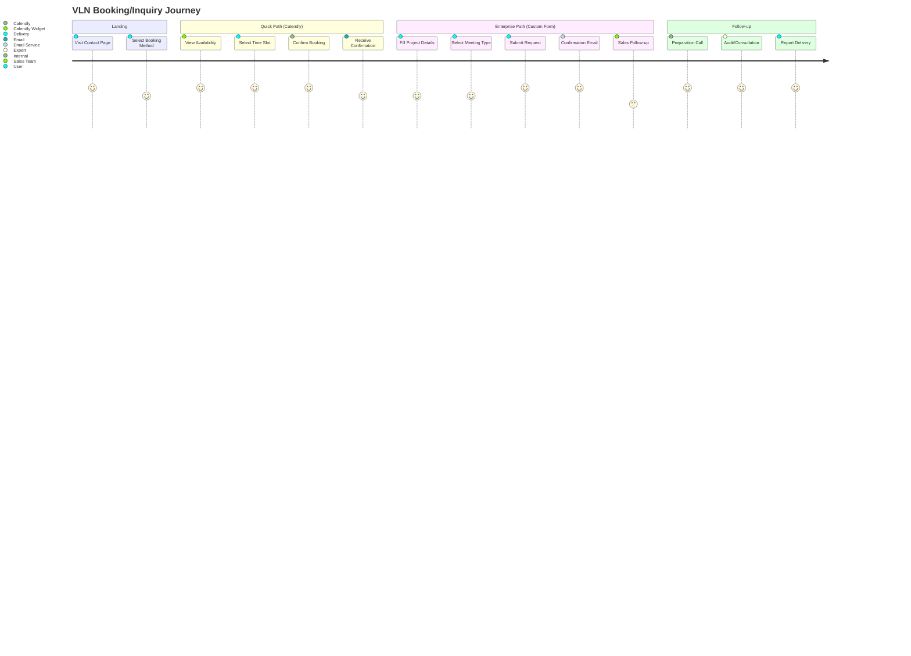
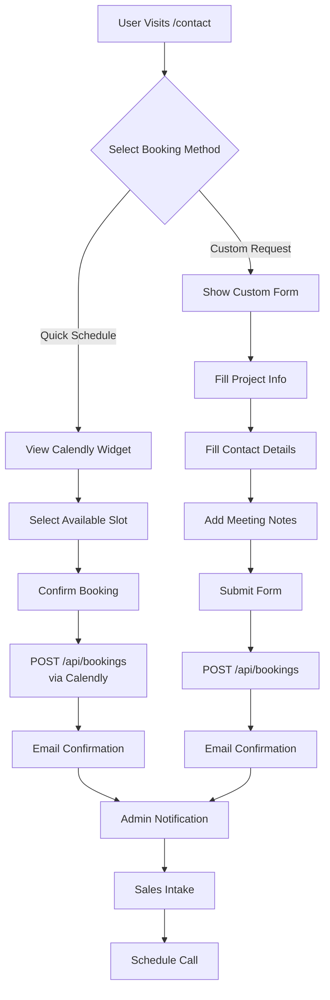
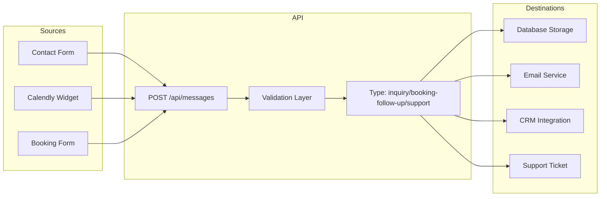

# VLN Booking & Sales Flow

## Overview
This document outlines the complete user journey for VLN booking and inquiry systems, integrating Calendly embedded flow with custom form fallback.

---

## User Journey Map



---

## Booking Flow Diagram



---

## Messaging System Architecture



---

## Calendly Embed Integration

### Why Calendly JavaScript SDK (Not iFrame)?

1. **Better Tracking**: Full event lifecycle capture
2. **Auto-resize**: Responsive to container width
3. **Pre-fill Support**: Auto-populate user data
4. **Event Hooks**: Trigger actions on booking confirmation
5. **Theme Control**: CSS variable customization

### Configuration

```typescript
// From CalendlyEmbed.tsx
const CALENDLY_URL = "https://calendly.com/hello-jlucus/30min?back=1";

// Theme Variables
--calendly-brand-color: #86d993 (VLN Sage Green)
--calendly-secondary-color: #7dd3fc (VLN Blue-Gray)
--calendly-text-color: #f8f9fa (VLN White)
--calendly-bg-color: #0a0e0f (VLN Background)
```

---

## API Endpoints

### POST /api/bookings
**Custom booking form submissions**
- Request: `BookingRequest` (date, time, notes)
- Response: `BookingResponse` with confirmation
- Validation: Business hours, federal holidays

### POST /api/messages
**General inquiries and follow-ups**
- Request: `MessageRequest` (type, source, content)
- Response: `MessageResponse` with message ID
- Types: inquiry, booking-follow-up, support
- Sources: contact-form, calendly-follow-up, booking-form

---

## Type Definitions

### MessageRequest
```typescript
interface MessageRequest {
  type: "inquiry" | "booking-follow-up" | "support";
  firstName: string;
  lastName: string;
  email: string;
  phone?: string;
  company?: string;
  subject: string;
  message: string;
  source: "contact-form" | "calendly-follow-up" | "booking-form";
}
```

### BookingRequest
```typescript
interface BookingRequest {
  appointmentType: "virtual" | "in-person";
  firstName: string;
  lastName: string;
  email: string;
  date: string; // YYYY-MM-DD
  time: string; // HH:MM (24-hour)
  notes: string;
}
```

---

## Contact Page Component Hierarchy

```
ContactContent
├── Header
├── Hero Section
├── Booking Method Toggle
│   ├── "Quick Schedule" (Calendly)
│   └── "Custom Request" (Form)
├── Dynamic Content Section
│   ├── CalendlyEmbed (if method === 'calendly')
│   │   └── Calendly Widget (JavaScript SDK)
│   └── BookingForm (if method === 'form')
│       ├── Appointment Type Selector
│       ├── Name Fields
│       ├── Email Field
│       ├── Date/Time Picker
│       └── Notes Textarea
├── Direct Contact Section
│   ├── Email Card
│   ├── Telegram Card
│   ├── Website Card
│   └── GitHub Card
├── What to Include Section
└── Footer
```

---

## Accessibility Considerations

- ✅ Semantic HTML (main, section, button)
- ✅ ARIA labels on form controls
- ✅ Keyboard navigation support
- ✅ WCAG AA color contrast (Sage #86d993 on dark bg)
- ✅ Focus visible indicators
- ✅ Error messages announced to screen readers

---

## Future Enhancements

1. **Calendly Pre-fill**: Auto-populate user data from form
2. **CRM Integration**: Sync bookings to Salesforce/HubSpot
3. **Email Automation**: Confirmation → reminder → follow-up sequence
4. **Analytics**: Track conversion rates by booking method
5. **A/B Testing**: Compare Calendly vs custom form effectiveness
6. **Multi-language**: Support non-English locales

---

## Deployment Notes

- **Environment Variables**: None required (URL is hardcoded)
- **CSP Headers**: Allow `calendly.com` script and styles
- **Performance**: Calendly SDK loads asynchronously (non-blocking)
- **Fallback**: Custom form works without JavaScript
