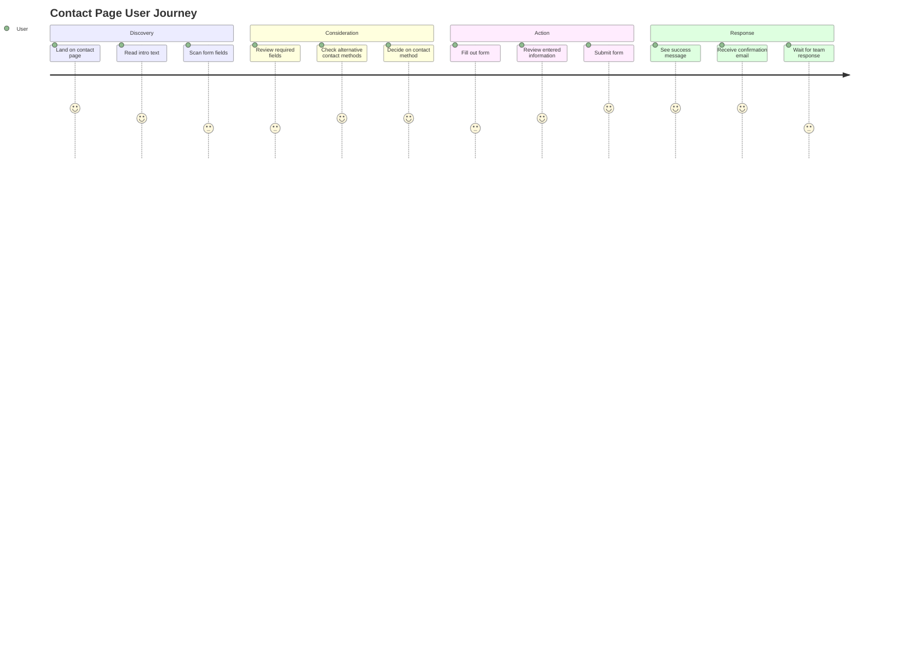
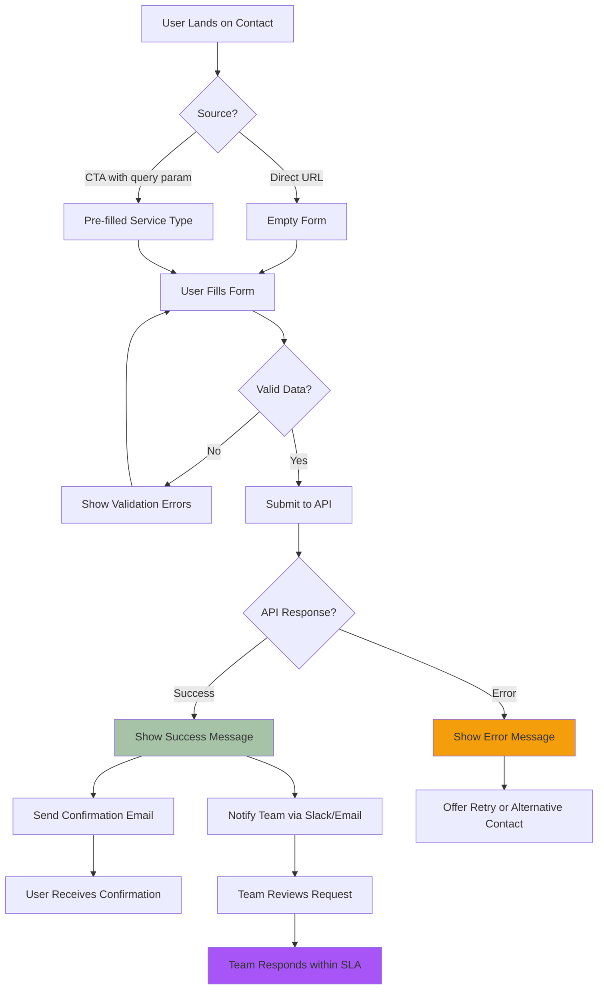
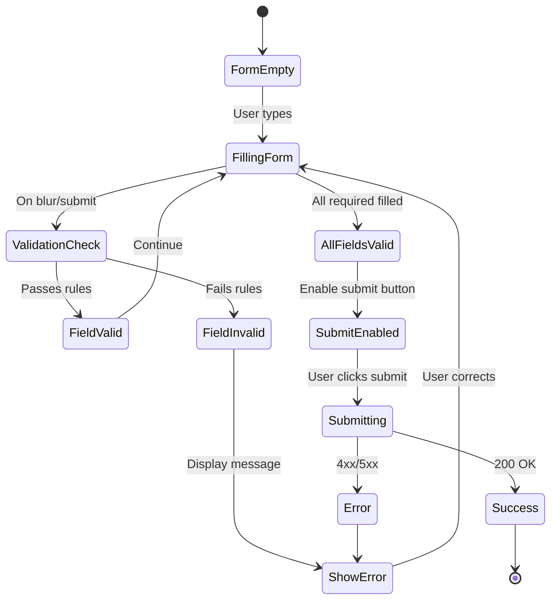
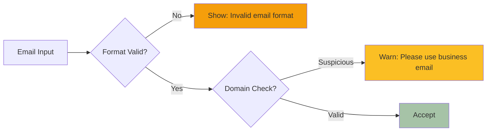
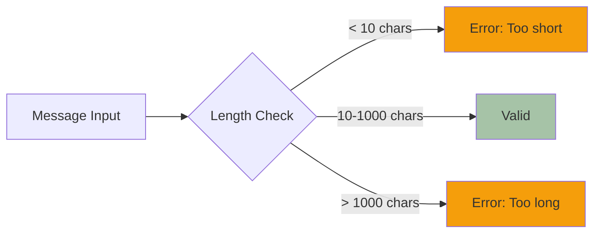
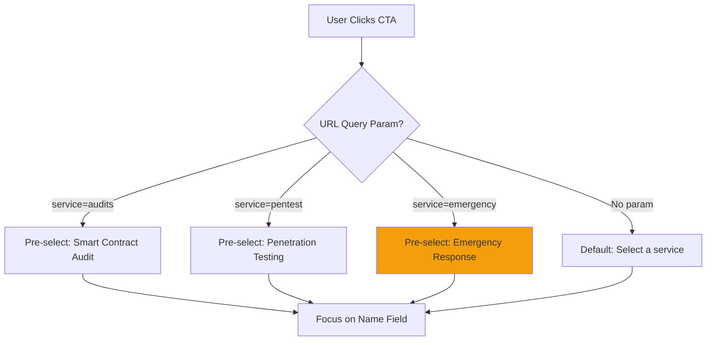

# Contact Page - UX Flow & Mockups

## ASCII Mockup - Contact Form

```
┌────────────────────────────────────────────────────────────────────────────────┐
│  [VLN Logo]                    Services    Pricing    Contact    [Get Help]    │
└────────────────────────────────────────────────────────────────────────────────┘

┌────────────────────────────────────────────────────────────────────────────────┐
│                                                                                 │
│                          Get in Touch                                           │
│                                                                                 │
│            Let's discuss how we can secure your smart contracts                │
│                                                                                 │
└────────────────────────────────────────────────────────────────────────────────┘

┌───────────────────────────────────────────────────────────────────────────────┐
│                                                                                │
│  ┌──────────────────────────────────────────────────────────────────────┐    │
│  │                        CONTACT FORM                                  │    │
│  │                                                                       │    │
│  │  Full Name *                                                         │    │
│  │  ┌─────────────────────────────────────────────────────────────┐    │    │
│  │  │ John Doe                                                     │    │    │
│  │  └─────────────────────────────────────────────────────────────┘    │    │
│  │                                                                       │    │
│  │  Email Address *                                                     │    │
│  │  ┌─────────────────────────────────────────────────────────────┐    │    │
│  │  │ john@example.com                                             │    │    │
│  │  └─────────────────────────────────────────────────────────────┘    │    │
│  │                                                                       │    │
│  │  Company / Project Name                                              │    │
│  │  ┌─────────────────────────────────────────────────────────────┐    │    │
│  │  │ Acme DeFi Protocol                                           │    │    │
│  │  └─────────────────────────────────────────────────────────────┘    │    │
│  │                                                                       │    │
│  │  Service Interested In *                                             │    │
│  │  ┌─────────────────────────────────────────────────────────────┐    │    │
│  │  │ Smart Contract Audit                                    [▼] │    │    │
│  │  └─────────────────────────────────────────────────────────────┘    │    │
│  │                                                                       │    │
│  │  Message *                                                           │    │
│  │  ┌─────────────────────────────────────────────────────────────┐    │    │
│  │  │ We're launching a new DeFi protocol and need a             │    │    │
│  │  │ comprehensive security audit before mainnet deployment...   │    │    │
│  │  │                                                              │    │    │
│  │  │                                                              │    │    │
│  │  └─────────────────────────────────────────────────────────────┘    │    │
│  │                                                                       │    │
│  │  [ ] Subscribe to VLN security newsletter                            │    │
│  │                                                                       │    │
│  │  ┌──────────────────────────┐                                       │    │
│  │  │      Send Message →      │                                       │    │
│  │  └──────────────────────────┘                                       │    │
│  │                                                                       │    │
│  │  Response time: Within 24 hours for general inquiries                │    │
│  │                 1-2 hours for emergency requests                     │    │
│  └──────────────────────────────────────────────────────────────────────┘    │
│                                                                                │
└───────────────────────────────────────────────────────────────────────────────┘

┌───────────────────────────────────────────────────────────────────────────────┐
│                           Alternative Contact Methods                          │
│                                                                                │
│   ┌──────────────────┐  ┌──────────────────┐  ┌──────────────────┐          │
│   │ [Mail Icon]      │  │ [Telegram Icon]  │  │ [Emergency Icon] │          │
│   │                  │  │                  │  │                  │          │
│   │ Email Us         │  │ Live Chat        │  │ Emergency        │          │
│   │ info@vln.gg      │  │ @vlngg           │  │ emergency@vln.gg │          │
│   │                  │  │                  │  │ 24/7 Response    │          │
│   │ [Email Now →]    │  │ [Open Chat →]    │  │ [Contact Now →]  │          │
│   └──────────────────┘  └──────────────────┘  └──────────────────┘          │
│                                                                                │
└───────────────────────────────────────────────────────────────────────────────┘

┌───────────────────────────────────────────────────────────────────────────────┐
│  RESOURCES        SERVICES           LEGAL          CONNECT                   │
│  About Us         Audits             Terms          [GitHub] [LinkedIn]       │
│  Get Help         Pen Test           Privacy        [Twitter] [Discord]       │
└───────────────────────────────────────────────────────────────────────────────┘
```

---

## User Journey Map



---

## Form Submission Flow



---

## Validation Flow



---

## Field Validations

### Email Field


### Message Field


---

## Service Selector Pre-fill Logic



---

## Success/Error States

### Success Message
```
┌─────────────────────────────────────────────┐
│  ✓ Message Sent Successfully!              │
│                                             │
│  Thank you for contacting VLN. We've       │
│  received your message and will respond    │
│  within 24 hours.                          │
│                                             │
│  A confirmation email has been sent to     │
│  john@example.com                          │
│                                             │
│  [Return to Homepage]  [View Our Services] │
└─────────────────────────────────────────────┘
```

### Error Message
```
┌─────────────────────────────────────────────┐
│  ✗ Submission Failed                        │
│                                             │
│  We couldn't send your message. Please     │
│  try again or use an alternative contact   │
│  method below.                             │
│                                             │
│  [Try Again]  [Email Us]  [Live Chat]      │
└─────────────────────────────────────────────┘
```

---

## Mobile Optimization

```
┌────────────────────────┐
│ [☰] [VLN] [Get Help]  │
└────────────────────────┘

┌────────────────────────┐
│    Get in Touch        │
│                        │
│  Let's discuss how we  │
│  can secure your       │
│  smart contracts       │
└────────────────────────┘

┌────────────────────────┐
│  Full Name *           │
│  ┌──────────────────┐  │
│  │ John Doe         │  │
│  └──────────────────┘  │
│                        │
│  Email *               │
│  ┌──────────────────┐  │
│  │ john@example.com │  │
│  └──────────────────┘  │
│                        │
│  (Scroll for more)     │
│                        │
│  ┌──────────────────┐  │
│  │  Send Message →  │  │
│  └──────────────────┘  │
└────────────────────────┘
```

---

## Accessibility Features

- ✅ Labels associated with inputs
- ✅ Required fields marked with asterisk + aria-required
- ✅ Error messages linked to fields with aria-describedby
- ✅ Focus order follows visual layout
- ✅ Submit button disabled until form valid
- ✅ Success/error messages announced to screen readers
- ✅ Keyboard submission (Enter key)

---

## Performance Considerations

- Client-side validation before API call
- Debounced email format check
- Form state persisted in localStorage (auto-save draft)
- Optimistic UI updates
- Rate limiting (1 submission per minute)

---

## Analytics Events

```javascript
// Track form interactions
gtag('event', 'contact_form_start');
gtag('event', 'contact_form_complete');
gtag('event', 'contact_form_submit_success');
gtag('event', 'contact_form_submit_error');

// Track alternative contact methods
gtag('event', 'contact_email_click');
gtag('event', 'contact_telegram_click');
gtag('event', 'contact_emergency_click');
```

---

**Last Updated:** January 2025
**Status:** Implemented ✅
