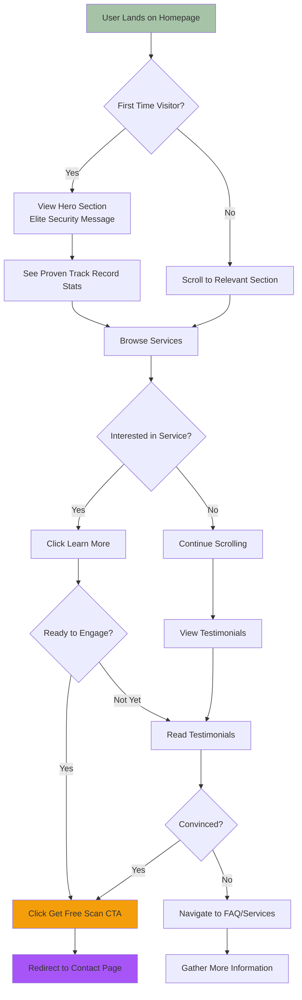
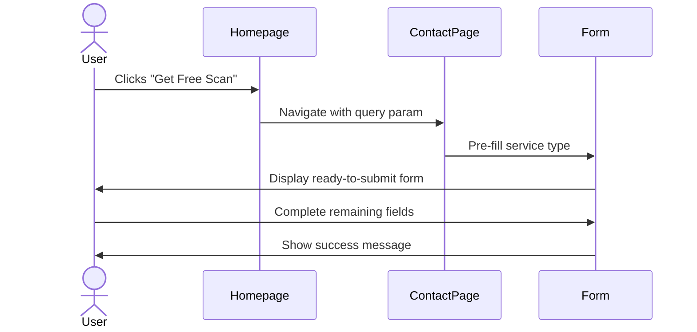
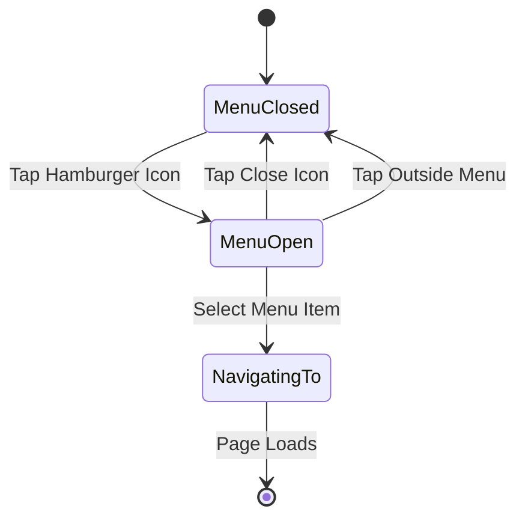

# Homepage - UX Flow & Mockups

## ASCII Mockup - Desktop View

```
┌────────────────────────────────────────────────────────────────────────────────────┐
│  [VLN Logo]                          Services    Pricing    Contact    [Get Help]  │
└────────────────────────────────────────────────────────────────────────────────────┘

┌────────────────────────────────────────────────────────────────────────────────────┐
│                                                                                     │
│                        Elite Smart Contract Security                                │
│                                                                                     │
│            Protecting blockchain gaming and DeFi with military-grade                │
│                        vulnerability research                                       │
│                                                                                     │
│                   [Get Free 30-Min Scan →]  [View Our Work]                       │
│                                                                                     │
│    ╔═══╗  ╔═══╗  ╔═══╗   ← Floating IC board animation                           │
│    ║IC ║  ║IC ║  ║IC ║                                                            │
│    ╚═══╝  ╚═══╝  ╚═══╝                                                            │
│                                                                                     │
└────────────────────────────────────────────────────────────────────────────────────┘

┌────────────────────────────────────────────────────────────────────────────────────┐
│                              Proven Track Record                                    │
│                                                                                     │
│   ┌───────────────┐  ┌───────────────┐  ┌───────────────┐  ┌───────────────┐    │
│   │ [Shield Icon] │  │ [Bug Icon]    │  │ [Cash Icon]   │  │ [Check Icon]  │    │
│   │               │  │               │  │               │  │               │    │
│   │     47        │  │     100%      │  │    $5.2M      │  │     12        │    │
│   │  Critical     │  │  Post-Audit   │  │  Recovered    │  │   Years       │    │
│   │Vulnerabilities│  │Success Rate   │  │               │  │ Experience    │    │
│   └───────────────┘  └───────────────┘  └───────────────┘  └───────────────┘    │
└────────────────────────────────────────────────────────────────────────────────────┘

┌────────────────────────────────────────────────────────────────────────────────────┐
│                              Our Services                                           │
│                                                                                     │
│   ┌────────────────────────────────┐    ┌────────────────────────────────┐        │
│   │  [Shield] Smart Contract Audits│    │ [Target] Penetration Testing   │        │
│   │                                 │    │                                │        │
│   │  • Line-by-line code review     │    │ • Red team attack simulation   │        │
│   │  • CVSS 3.1 risk scoring        │    │ • Infrastructure testing       │        │
│   │  • Free fix verification        │    │ • Social engineering tests     │        │
│   │                                 │    │                                │        │
│   │  Starting at $2,000             │    │  Starting at $3,500            │        │
│   │                                 │    │                                │        │
│   │        [Learn More →]           │    │       [Learn More →]           │        │
│   └────────────────────────────────┘    └────────────────────────────────┘        │
│                                                                                     │
│   ┌────────────────────────────────┐    ┌────────────────────────────────┐        │
│   │ [Code] Secure Development       │    │ [Zap] Emergency Response       │        │
│   │                                 │    │                                │        │
│   │  • Custom smart contract dev    │    │ • 24/7 incident response       │        │
│   │  • Security-first architecture  │    │ • Exploit mitigation           │        │
│   │  • Built-in audit compliance    │    │ • Forensic analysis            │        │
│   │                                 │    │                                │        │
│   │  Custom Quote                   │    │  Immediate Response            │        │
│   │                                 │    │                                │        │
│   │        [Learn More →]           │    │     [Contact Now →]            │        │
│   └────────────────────────────────┘    └────────────────────────────────┘        │
└────────────────────────────────────────────────────────────────────────────────────┘

┌────────────────────────────────────────────────────────────────────────────────────┐
│                           What Our Clients Say                                      │
│                                                                                     │
│   ┌──────────────────────────────────────┐  ┌──────────────────────────────────┐  │
│   │ "VLN identified a critical           │  │ "The most thorough audit we've  │  │
│   │  reentrancy vulnerability that       │  │  ever received. They found      │  │
│   │  could have cost us millions..."     │  │  issues our previous auditors   │  │
│   │                                      │  │  completely missed."            │  │
│   │  — Alex Chen                         │  │                                 │  │
│   │    CTO, DefiProtocol                 │  │  — Sarah Martinez               │  │
│   └──────────────────────────────────────┘  │    Lead Dev, GameFi Platform    │  │
│                                              └──────────────────────────────────┘  │
└────────────────────────────────────────────────────────────────────────────────────┘

┌────────────────────────────────────────────────────────────────────────────────────┐
│                        Ready to Secure Your Smart Contracts?                        │
│                                                                                     │
│                 Get a free 30-minute vulnerability scan and security                │
│                            consultation with our team.                              │
│                                                                                     │
│                            [Get Free Scan →]                                        │
│                                                                                     │
└────────────────────────────────────────────────────────────────────────────────────┘

┌────────────────────────────────────────────────────────────────────────────────────┐
│  RESOURCES        SERVICES           LEGAL          CONNECT                        │
│  About Us         Audits             Terms          [GitHub]  [LinkedIn]           │
│  Get Help         Pen Test           Privacy        [Twitter] [Discord]            │
│  FAQ              Development        Refunds        [Telegram]                      │
│  Blog             Design                                                            │
│                   VLN University                                                    │
│                                                                                     │
│  © 2025 VLN - Fused Gaming                                                         │
└────────────────────────────────────────────────────────────────────────────────────┘
```

## Mobile View (< 768px)

```
┌──────────────────────────────┐
│ [☰] [VLN Logo]     [Get Help]│
└──────────────────────────────┘

┌──────────────────────────────┐
│                               │
│    Elite Smart Contract       │
│         Security              │
│                               │
│  Protecting blockchain        │
│  gaming and DeFi with         │
│  military-grade research      │
│                               │
│   [Get Free 30-Min Scan]     │
│      [View Our Work]         │
│                               │
│    ╔═══╗  ╔═══╗              │
│    ║IC ║  ║IC ║              │
│    ╚═══╝  ╚═══╝              │
└──────────────────────────────┘

┌──────────────────────────────┐
│   Proven Track Record         │
│                               │
│  ┌────────────────────────┐  │
│  │ [Shield Icon]          │  │
│  │        47              │  │
│  │   Critical Vulns       │  │
│  └────────────────────────┘  │
│                               │
│  ┌────────────────────────┐  │
│  │ [Bug Icon]             │  │
│  │        100%            │  │
│  │  Post-Audit Success    │  │
│  └────────────────────────┘  │
│                               │
│  (Swipe for more stats →)     │
└──────────────────────────────┘

┌──────────────────────────────┐
│      Our Services             │
│                               │
│  ┌──────────────────────┐    │
│  │ [Shield] Audits      │    │
│  │                      │    │
│  │ Line-by-line review  │    │
│  │ From $2,000          │    │
│  │                      │    │
│  │   [Learn More →]     │    │
│  └──────────────────────┘    │
│                               │
│  (Scroll for more services)   │
└──────────────────────────────┘
```

---

## User Flow Diagram



---

## Interaction Flows

### CTA Button Flow



---

### Mobile Menu Flow



---

### Scroll Animation Triggers

```mermaid
graph LR
    A[Page Load] --> B[Hero Fades In]
    B --> C[User Scrolls Down]
    C --> D[Stats Section Enters Viewport]
    D --> E[Stat Cards Stagger Fade In]
    E --> F[Continue Scroll]
    F --> G[Services Section Enters]
    G --> H[Service Cards Animate]
    H --> I[Testimonials Section]
    I --> J[Testimonial Cards Fade In]

    style B fill:#a6c3a7
    style E fill:#aab7c8
    style H fill:#f59e0b
    style J fill:#a855f7
```



---

## Key Interactions

### 1. Hero Section
- **Load Animation**: Fade in from below with 200ms delay
- **IC Board**: Continuous floating animation
- **CTA Hover**: Glow effect (sage green), lift 2px
- **Mobile**: Stack vertically, reduce animation complexity

### 2. Stats Cards
- **Enter Animation**: Stagger fade (150ms delay between cards)
- **Hover**: Lift 2px, increase glow intensity
- **Mobile**: Horizontal scroll snap, 2 visible at a time

### 3. Services Grid
- **Layout**: 2x2 grid on desktop, stack on mobile
- **Hover**: Card lifts, border glow increases
- **Click**: Navigate to /services with anchor to specific service

### 4. Testimonials
- **Desktop**: 3 cards side-by-side
- **Tablet**: 2 cards
- **Mobile**: Single card, swipe to view more
- **Animation**: Fade in on scroll

### 5. Final CTA
- **Position**: Above footer
- **Emphasis**: Larger text, stronger contrast
- **Action**: Same as hero CTA (redirect to contact)

---

## Accessibility Considerations

- ✅ Keyboard navigation through all CTAs
- ✅ Focus indicators on all interactive elements
- ✅ Alt text on all icons and graphics
- ✅ ARIA labels on stat cards
- ✅ Sufficient color contrast (WCAG AA)
- ✅ Skip to main content link
- ✅ Screen reader friendly card structure

---

## Performance Metrics

**Target Lighthouse Scores:**
- Performance: > 90
- Accessibility: 100
- Best Practices: 100
- SEO: 100

**Key Optimizations:**
- Lazy load below-fold images
- Defer non-critical JS
- Optimize IC board animation (Canvas API)
- Minimize layout shift (CLS < 0.1)
- Fast LCP (< 2.5s)

---

**Last Updated:** January 2025
**Status:** Implemented ✅
