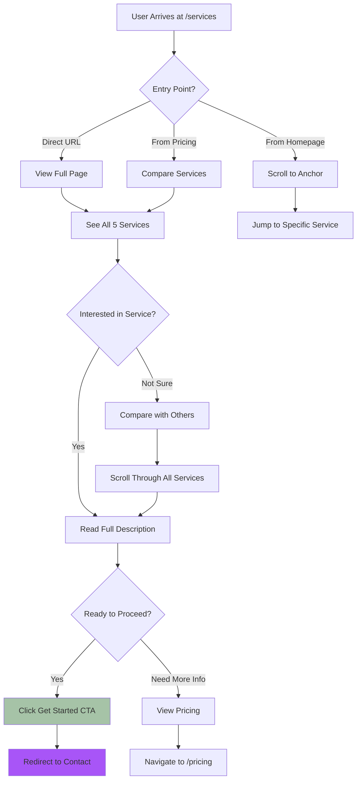
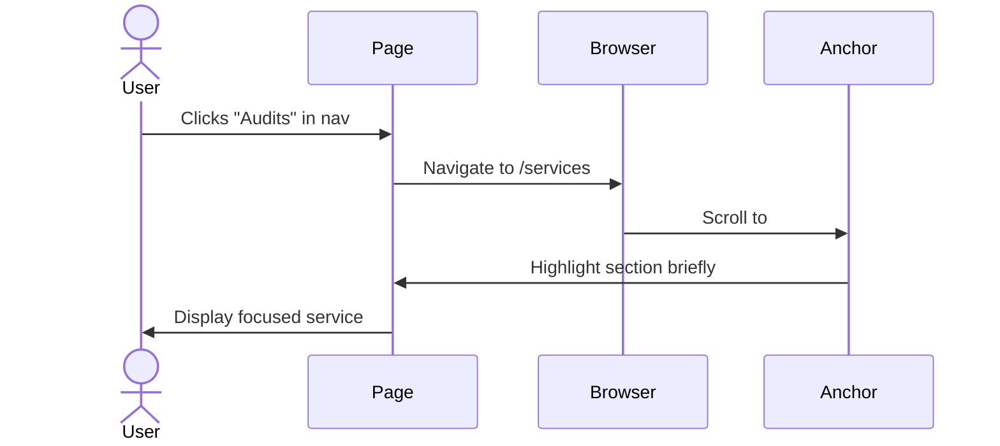
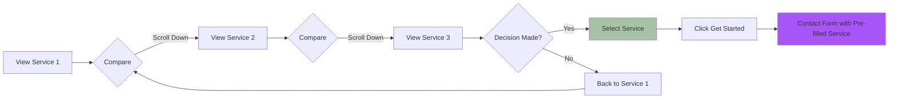
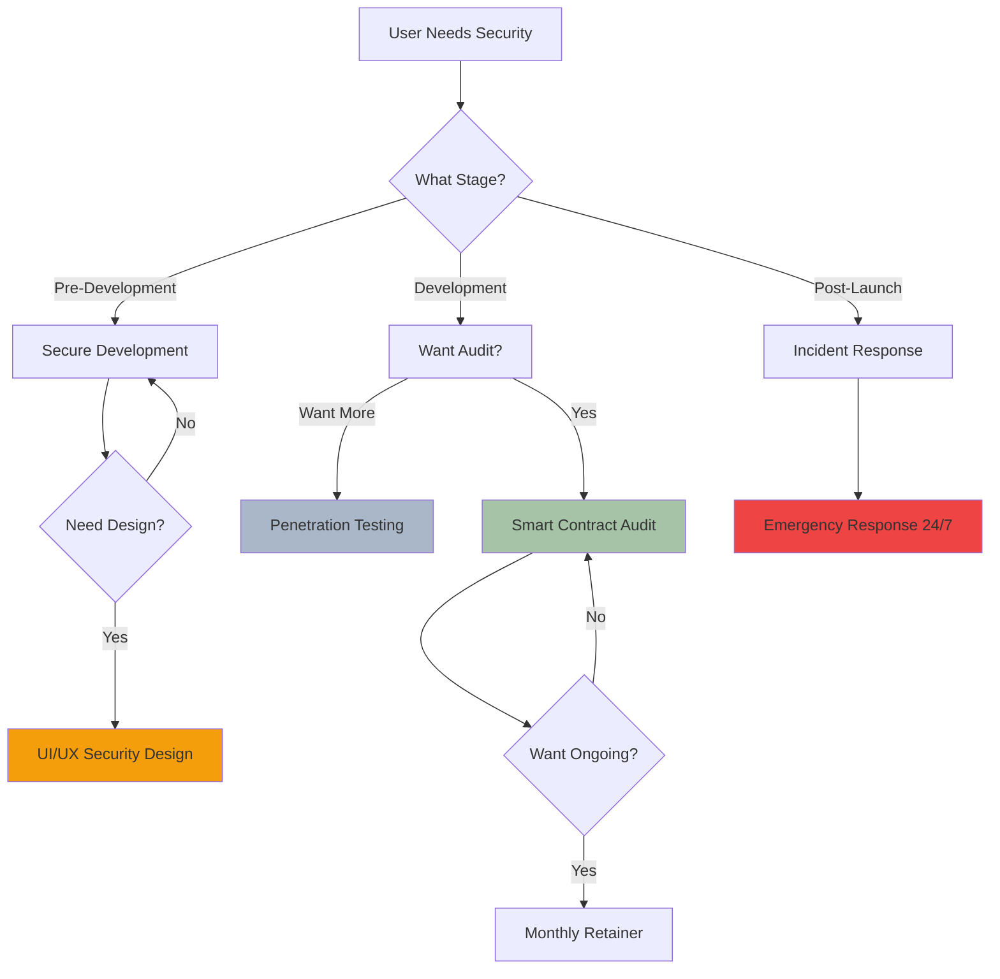
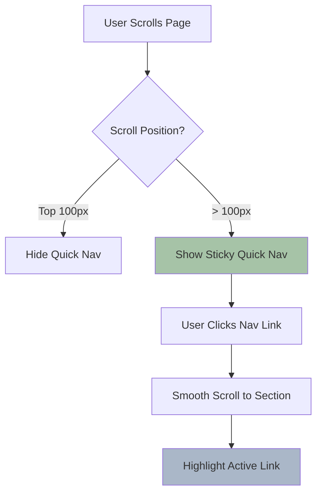
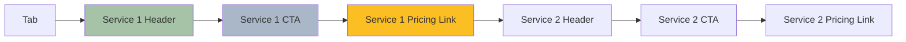

# Services Page - Navigation & UX Flows

## Service Discovery Flow



---

## Service Page Structure

```
┌────────────────────────────────────────────────────────────────────────────────┐
│  [VLN Logo]                    Services    Pricing    Contact    [Get Help]    │
└────────────────────────────────────────────────────────────────────────────────┘

┌────────────────────────────────────────────────────────────────────────────────┐
│                                                                                 │
│                          Our Services                                           │
│                                                                                 │
│            Comprehensive security solutions for blockchain gaming               │
│                        and DeFi protocols                                       │
│                                                                                 │
└────────────────────────────────────────────────────────────────────────────────┘

┌────────────────────────────────────────────────────────────────────────────────┐
│                       🔍 Quick Navigation                                       │
│                                                                                 │
│  [Audits] [Pen Testing] [Development] [Design] [VLN University]              │
└────────────────────────────────────────────────────────────────────────────────┘

┌────────────────────────────────────────────────────────────────────────────────┐
│  ┌─── Smart Contract Audits ───────────────────────────────────────────────┐  │
│  │                                                                           │  │
│  │  [Shield Icon - Large]                                                   │  │
│  │                                                                           │  │
│  │  Line-by-line code review with military-grade threat analysis           │  │
│  │                                                                           │  │
│  │  ✓ CVSS 3.1 risk scoring                                                │  │
│  │  ✓ Formal verification support                                          │  │
│  │  ✓ Gas optimization review                                              │  │
│  │  ✓ Economic attack modeling                                             │  │
│  │  ✓ Free fix verification                                                │  │
│  │  ✓ Post-audit support                                                   │  │
│  │                                                                           │  │
│  │  Pricing: Starting at $2,000                                             │  │
│  │  Timeline: 3-14 days depending on complexity                             │  │
│  │                                                                           │  │
│  │  ┌────────────────────┐  ┌────────────────────┐                        │  │
│  │  │  Get Started →     │  │  View Pricing →     │                        │  │
│  │  └────────────────────┘  └────────────────────┘                        │  │
│  └───────────────────────────────────────────────────────────────────────────┘  │
└────────────────────────────────────────────────────────────────────────────────┘

┌────────────────────────────────────────────────────────────────────────────────┐
│  ┌─── Penetration Testing ──────────────────────────────────────────────────┐  │
│  │                                                                           │  │
│  │  [Target Icon - Large]                                                   │  │
│  │                                                                           │  │
│  │  Red team simulation and infrastructure hardening                        │  │
│  │                                                                           │  │
│  │  ✓ Smart contract exploit testing                                       │  │
│  │  ✓ Infrastructure security assessment                                   │  │
│  │  ✓ Social engineering evaluation                                        │  │
│  │  ✓ API security testing                                                 │  │
│  │  ✓ Wallet security review                                               │  │
│  │  ✓ Comprehensive report with remediation                                │  │
│  │                                                                           │  │
│  │  Pricing: Starting at $3,500                                             │  │
│  │  Timeline: 1-2 weeks                                                     │  │
│  │                                                                           │  │
│  │  ┌────────────────────┐  ┌────────────────────┐                        │  │
│  │  │  Get Started →     │  │  View Pricing →     │                        │  │
│  │  └────────────────────┘  └────────────────────┘                        │  │
│  └───────────────────────────────────────────────────────────────────────────┘  │
└────────────────────────────────────────────────────────────────────────────────┘

  (Pattern repeats for Development, Design, VLN University)
```

---

## Anchor Link Navigation



---

## Service Comparison Flow



---

## Mobile Service Cards

```
┌────────────────────────┐
│  Smart Contract        │
│  Audits                │
│                        │
│  [Shield Icon]         │
│                        │
│  ✓ Line-by-line review │
│  ✓ CVSS 3.1 scoring    │
│  ✓ Free fix verify     │
│                        │
│  From $2,000           │
│  3-14 days             │
│                        │
│  ┌──────────────────┐  │
│  │  Get Started →   │  │
│  └──────────────────┘  │
│  [View Pricing]        │
└────────────────────────┘

(Swipe up for next service ↑)
```

---

## Service Selection Decision Tree



---

## CTA Button States

```mermaid
stateDiagram-v2
    [*] --> Default
    Default --> Hover: Mouse over
    Hover --> Default: Mouse out
    Hover --> Pressed: Click
    Pressed --> Loading: API call
    Loading --> Success: Response 200
    Loading --> Error: Response error
    Success --> [*]: Redirect
    Error --> Default: Show error
```

---

## Sticky Navigation Behavior



---

## Service Card Interaction States

### Default State
```
┌─────────────────────────────────┐
│ [Icon]  Service Name            │
│                                 │
│ Description text...             │
│                                 │
│ Features list                   │
│                                 │
│ [ Get Started → ]               │
└─────────────────────────────────┘
Border: sage/20
Shadow: none
```

### Hover State
```
┌─────────────────────────────────┐
│ [Icon]  Service Name            │←─ Lift 2px
│                                 │
│ Description text...             │
│                                 │
│ Features list                   │
│                                 │
│ [ Get Started → ]               │
└─────────────────────────────────┘
Border: sage/40
Shadow: 0 0 20px sage/40
```

### Active State (Clicked)
```
┌─────────────────────────────────┐
│ [Icon]  Service Name            │
│                                 │
│ Description text...             │
│                                 │
│ Features list                   │
│                                 │
│ [ ⟳ Loading... ]                │
└─────────────────────────────────┘
Border: sage/60
Button: Disabled state
```

---

## Accessibility Navigation



**Keyboard Shortcuts:**
- `Tab`: Next focusable element
- `Shift+Tab`: Previous focusable element
- `Enter/Space`: Activate button/link
- `1-5`: Jump to service (with accesskey attribute)

---

## Analytics Tracking

```javascript
// Track service views
gtag('event', 'service_view', {
  service_name: 'Smart Contract Audit',
  scroll_depth: '50%'
});

// Track CTA clicks
gtag('event', 'service_cta_click', {
  service_name: 'Smart Contract Audit',
  cta_type: 'get_started'
});

// Track navigation usage
gtag('event', 'quick_nav_click', {
  target_service: 'Penetration Testing',
  from_position: 'sticky_nav'
});
```

---

## SEO Optimization

### Service Page Structure
- **H1**: "Our Services" (page title)
- **H2**: Each service name (Smart Contract Audits, etc.)
- **H3**: Feature sections within each service
- **Schema Markup**: Service type, offers, pricing

### Meta Tags
```html
<title>Security Services | VLN - Smart Contract Audits & More</title>
<meta name="description" content="Comprehensive blockchain security services: smart contract audits, penetration testing, secure development, and emergency incident response.">
```

---

**Last Updated:** January 2025
**Status:** Implemented ✅
