# VLN Execution Strategy — Parallel Phase Development

**Date:** 2026-02-25
**Strategy:** Balanced Option 4 — Phase 1 Quick Wins + Phase 2 Auth Foundation (Parallel Tracks)
**Approach:** Modular parallelization with mermaid-driven task decomposition

---

## 🎯 Strategic Recommendation

**Why Option 4?**
- ✅ **Quick Phase 1 wins** = immediate deliverables & momentum
- 🔄 **Phase 2 auth foundation** = unblocks downstream development
- ⚡ **Parallel execution** = maximize throughput across work streams
- 📊 **Clear dependencies** = minimal blocking between tracks

---

## 📊 Execution Flowchart

```mermaid
graph TD
    A["🎯 Start: Phase 1 + Phase 2 Bootstrap"] --> B["Track A: Phase 1 Cleanup"]
    A --> C["Track B: Phase 2 v1.1.0 Auth"]
    A --> D["Track C: Infrastructure Planning"]

    B --> B1["Complete DB & Sessions"]
    B --> B2["Monitoring & Error Tracking"]
    B --> B3["Security Scanning Setup"]

    C --> C1["Email/Password Auth"]
    C --> C2["OAuth Integration"]
    C --> C3["Audit Intake Form"]

    D --> D1["Prisma Schema"]
    D --> D2["API Contract Design"]
    D --> D3["Email Infrastructure"]

    B1 --> E["✅ Phase 1 Complete"]
    B2 --> E
    B3 --> E

    C1 --> F["✅ Phase 2 v1.1.0 Foundation"]
    C2 --> F
    C3 --> F

    D1 --> F
    D2 --> F
    D3 --> F

    E --> G["🚀 Merge to integration/vln"]
    F --> G
```



---

## 🔀 Task Decomposition by Track

### **Track A: Phase 1 Cleanup** (Parallel Agent)
**Goal:** Complete 18 remaining items from v0.11.0
**Duration:** 2-3 sprints
**Deliverable:** Production-ready infrastructure

```mermaid
graph LR
    A["Phase 1 Open Items<br/>18 Tasks"] --> B["Production Layer"]
    A --> C["Monitoring Layer"]
    A --> D["Security Layer"]

    B --> B1["PostgreSQL + Prisma"]
    B --> B2["Session Management"]
    B --> B3["CDN Config"]

    C --> C1["Sentry/Error Tracking"]
    C --> C2["Performance Analytics"]
    C --> C3["Uptime Monitoring"]

    D --> D1["npm audit"]
    D --> D2["Semgrep SAST"]
    D --> D3["Dependency Scanning"]

    B1 --> E["✅ Infrastructure Complete"]
    B2 --> E
    B3 --> E
    C1 --> E
    C2 --> E
    C3 --> E
    D1 --> E
    D2 --> E
    D3 --> E
```



**Agent Prompt (Track A):**
```
You are responsible for Phase 1 cleanup (v0.11.0).

Scope:
- PostgreSQL provisioning with Prisma schema
- Session management & JWT implementation
- CDN configuration (Vercel or Cloudflare)
- Error tracking (Sentry setup)
- Performance analytics (Vercel Web Analytics)
- Uptime monitoring & alerting
- Security scanning automation (npm audit + Semgrep)

Branch: feature/phase1-infrastructure
Base: integration/vln

Deliverables:
1. Database schema (schema.prisma)
2. Session middleware
3. Monitoring dashboards
4. Security scan CI/CD step
5. Documentation in CLAUDE.md

Success Criteria:
- Build passes
- Tests pass (>80% coverage)
- No security vulnerabilities
- Performance baseline established
```

---

### **Track B: Phase 2 v1.1.0 Auth Foundation** (Parallel Agent)
**Goal:** Build authentication system & audit intake
**Duration:** 2-3 sprints
**Deliverable:** Auth complete, audit form functional

```mermaid
graph LR
    A["Phase 2 v1.1.0<br/>Auth + Intake"] --> B["Authentication"]
    A --> C["Audit Intake"]
    A --> D["Infrastructure"]

    B --> B1["Email/Password"]
    B --> B2["OAuth<br/>Google/GitHub"]
    B --> B3["Magic Links<br/>& 2FA"]

    C --> C1["Audit Form"]
    C --> C2["Contract Upload"]
    C --> C3["Scope Wizard"]

    D --> D1["Email Service<br/>Transactional"]
    D --> D2["File Storage<br/>S3/Blob"]
    D --> D3["Notifications"]

    B1 --> E["✅ v1.1.0 Ready"]
    B2 --> E
    B3 --> E
    C1 --> E
    C2 --> E
    C3 --> E
    D1 --> E
    D2 --> E
    D3 --> E
```



**Agent Prompt (Track B):**
```
You are responsible for Phase 2 v1.1.0 (Operationalize Audits).

Scope:
- User authentication (email/password, OAuth via Auth0/NextAuth)
- Magic link authentication & SMS 2FA
- Audit request form with contract uploads
- Scope definition wizard
- Transactional email pipeline
- Real-time notifications

Branch: feature/phase2-auth-intake
Base: integration/vln

Deliverables:
1. NextAuth.js configuration
2. User model in Prisma
3. Audit intake schema
4. Email service integration
5. Upload handler for contracts
6. Form components (scope wizard)
7. API routes: POST /api/auth/*, POST /api/audits/intake

Success Criteria:
- Build passes
- Tests pass (>80% coverage)
- OAuth flow tested end-to-end
- Email delivery confirmed
- File upload security verified
```

---

### **Track C: Infrastructure Planning** (Parallel Agent)
**Goal:** Design schemas & contracts for all phases
**Duration:** 1 sprint
**Deliverable:** API contracts & database schemas ready for implementation

```mermaid
graph LR
    A["Infrastructure Planning"] --> B["Database Schema"]
    A --> C["API Contracts"]
    A --> D["Email Pipeline"]

    B --> B1["Users & Auth"]
    B --> B2["Audits & Reports"]
    B --> B3["Payments & Billing"]

    C --> C1["Auth Endpoints"]
    C --> C2["Audit Endpoints"]
    C --> C3["Client Portal API"]

    D --> D1["Email Templates"]
    D --> D2["Notification Types"]
    D --> D3["Webhook Events"]

    B1 --> E["✅ Contracts Ready"]
    B2 --> E
    B3 --> E
    C1 --> E
    C2 --> E
    C3 --> E
    D1 --> E
    D2 --> E
    D3 --> E
```



**Agent Prompt (Track C):**
```
You are responsible for infrastructure design & contracts.

Scope:
- Complete Prisma schema for Phases 1-3
- RESTful API contract documentation
- Email template definitions
- Webhook event specifications
- Rate limiting & quota design
- RBAC model definition

Branch: feature/infrastructure-planning
Base: integration/vln

Deliverables:
1. schema.prisma (users, audits, payments, reports)
2. OpenAPI spec (api.json)
3. Email template registry
4. Webhook event catalog
5. Rate limit & quota policies
6. Architecture decision records (docs/technical/adr/)

Success Criteria:
- Schema supports all Phase 1-3 features
- API spec is Swagger-compliant
- Email templates cover all user journeys
- Contracts reviewed & approved
- No breaking changes from v0.11.0
```

---

## 🚀 Parallel Execution Timeline

```mermaid
gantt
    title VLN Parallel Execution — Weeks 1-4
    dateFormat YYYY-MM-DD

    section Track A
    Phase 1 Infrastructure :a1, 2026-02-25, 21d
    DB + Sessions :a2, after a1, 7d
    Monitoring Setup :a3, after a2, 7d
    Merge Phase 1 :a4, after a3, 1d

    section Track B
    Phase 2 Auth Foundation :b1, 2026-02-25, 21d
    Email/Password + OAuth :b2, after b1, 7d
    Audit Intake Form :b3, after b2, 7d
    Merge Phase 2 v1.1.0 :b4, after b3, 1d

    section Track C
    Schema & Contracts :c1, 2026-02-25, 7d
    API Specs :c2, after c1, 7d
    Email & Webhook Design :c3, after c2, 7d
    Contracts Ready :c4, after c3, 1d
```



---

## 📋 Agent Launch Commands

**When you're ready, launch parallel agents:**

```bash
# Track A: Phase 1 Infrastructure
Agent: Explore (general-purpose)
Task: "Complete Phase 1 v0.11.0 infrastructure — database, sessions, monitoring, security scanning"

# Track B: Phase 2 Auth
Agent: Task (general-purpose)
Task: "Build Phase 2 v1.1.0 authentication & audit intake — email/password, OAuth, forms"

# Track C: Infrastructure Planning
Agent: Task (general-purpose)
Task: "Design infrastructure contracts — Prisma schema, API specs, email templates"
```

---

## ✅ Success Criteria (Across All Tracks)

- [ ] All builds pass
- [ ] All tests pass (80%+ coverage)
- [ ] No security vulnerabilities
- [ ] Conventional commits on all PRs
- [ ] PRs base on `integration/vln`
- [ ] Documentation updated
- [ ] Mermaid diagrams reflect final state

---

## 📝 Next Steps

1. **Approve this strategy** → Begin track assignments
2. **Launch agents in parallel** → 3 concurrent work streams
3. **Daily syncs** → Track blockers & dependencies
4. **Merge to integration/vln** → After track completion
5. **Update PHASE_TRACKING.md** → Log completion status

---

## 🔗 Related Documents

- [PHASE_TRACKING.md](./PHASE_TRACKING.md) — Full 190-issue breakdown
- [CLAUDE.md](../../CLAUDE.md) — Project guidelines
- GitHub Issues: [#64](https://github.com/Fused-Gaming/vln/issues/64) | [#114](https://github.com/Fused-Gaming/vln/issues/114) | [#149](https://github.com/Fused-Gaming/vln/issues/149)
